# Rongbao Illustrations / 绒宝配图

> 把中文文章里的判断、流程、状态和隐喻，变成一张张白底、手绘、怪诞但清爽的正文配图。
>
> 16:9 正文配图 + 3:4/21:9/1:1 社交卡片 | 绒宝 / 牙仔 / 阿龅 IP | Codex Skill

---

## 这个仓库是什么

Rongbao Illustrations 是一个 Codex Skill，用来指导 AI Agent 为中文文章、帖子、博客、Notion 文档和方法论内容生成正文配图，并在明确提出绒宝、牙仔或阿龅 IP 的封面、竖版海报或方图请求时，按需组合目标设计 Skill。

它不是通用插画 prompt，也不是 PPT 信息图模板。它的核心目标是：先理解文章里的认知锚点，再把其中一个判断、流程、结构、状态或隐喻，变成一张有记忆点的 16:9 手绘解释图。

默认视觉 IP 是“牙仔”：参考 `rongbao-illustrations/assets/yazai.png` 和 [`references/yazai-identity.md`](rongbao-illustrations/references/yazai-identity.md) 的黑白拟人猫、黑色尖耳、头顶毛块、半眯竖瞳、宽扁脸、两颗小门牙、胡须、长卷尾、白衬衫、黑马甲或黑领结和围裙，并转译成白底极简手绘角色。也可以按名称显式选择绒宝、牙仔或阿龅；每个角色都不是贴纸或站在角落里的装饰物，而是正在认真参与系统运转的荒诞工作者。

一句话：**让 AI 不只是“配一张图”，而是把文章里的一个关键认知动作画出来。**

---

## 适合谁用

特别适合：

- 写中文文章，需要正文配图和文章插图的人
- 做知识型内容、方法论内容、AI 工作流内容的人
- 想把抽象判断画成具体隐喻的人
- 想要一种比 PPT 信息图更轻、更怪、更有个人识别度的配图风格的人
- 用 Codex 做内容生产，希望稳定复用一套视觉语言的人

不适合：

- 想要商业插画、品牌 KV 或精致扁平插画的人
- 想要传统 PPT 信息图、复杂架构图或流程图的人
- 想要儿童卡通、可爱 IP、表情包风格的人
- 想把大量正文、长段解释或完整课程页塞进一张图里的人
- 需要严格可编辑矢量源文件的人

---

## 它会产出什么

默认输出：

- 16:9 横版正文配图
- 一篇文章的 4-8 张 shot list
- 每张图的主题、核心意思、结构类型、已选角色动作和中文标注建议
- 最终 PNG 图片，保存到 workspace 的 `assets/<article-slug>-illustrations/`

按需组合输出：

- 横版封面（`landscape-cover`）
- 竖版海报（`portrait-poster`）
- 方图（`square-graphic`）
- 可选萌粒小插图、角色锚点、转面图、3:4 信息图和 3:4 贴纸页（需用户确认安装上游 Skill）
- 可选 Baoyu 文章配图、知识漫画、封面、信息图、幻灯片和小红书图片（需用户确认安装对应上游 Skill）
- 可选 Guizang Social Card 小红书图文组图、瑞士风卡片、电子杂志风卡片、公众号 21:9 + 1:1 封面对和 Live Photo（需用户确认安装对应上游 Skill）

组合输出的画幅、构图、材质、光线、文字、尺寸和保存方式由目标设计 Skill 决定。

原生模式默认不输出：

- PPTX / PDF / Keynote
- SVG / HTML / Canvas 可编辑图
- 商业海报或封面 KV
- 大段文字型信息图

---

## 视觉风格

这个 Skill 默认使用“牙仔黑白怪诞正文配图”风格：

- 纯白背景，不要纸纹、米色、阴影、渐变
- 黑色手绘线稿，细线，轻微抖动
- 大量留白，主体只占画面约 40%-60%
- 少量红色、橙色、蓝色中文手写批注
- 一张图只表达一个核心动作、结构、状态或隐喻
- 已选角色必须参与核心动作，不能只是装饰
- 生成时读取角色注册表声明的参考图；只保留身份锚点，不复制参考图的 3D 绒毛、米色背景、渐变或阴影。
- 怪诞、有创意、清爽；友好灵动，但不幼儿化、不用可爱表情替代结构表达

以上是正文配图原生模式的默认值。跨到其他设计 Skill 时，每个已选角色只提供自己的身份锚点；目标 Skill 决定媒介表现。

组合图中角色要与场景共享媒介和光线，绒宝身份色默认保持鲜亮黄/青绿/橙，牙仔和阿龅分别遵循自己的黑白身份协议；禁止综合色偏、统一降饱和或复古做旧伪装融合。若出现参考图材质残留或贴片感，只针对角色做一次融合迭代，保持构图、标题、配色和所有身份锚点不变。多个角色必须分别保持身份并共同承担核心动作，不能融合成一个混合角色。

---

## 跨设计 Skill 组合

### 按名称选择角色

角色由 `rongbao-illustrations/references/character-registry.json` 注册表解析：

- 不写角色名，或只写“这个IP / 该IP”：默认选择牙仔（`yazai`）。
- `绒宝` / `rongbao` 选择绒宝；`牙仔` / `yazai` 选择牙仔；`阿龅` / `abao` 选择阿龅，英文别名不区分大小写。
- 同一请求写任意两个或三个已注册名称，例如“绒宝和牙仔”“牙仔与阿龅”或“绒宝、牙仔和阿龅”：所有角色都入图，分别保留身份并共同参与核心动作。
- 明确写出未注册的 IP 名称时不猜测替代角色，返回支持列表（绒宝、牙仔、阿龅）并要求改用支持名称。

注册表还声明每个角色的 `asset` 和 `identity_reference`；原生正文沿用白底手绘规则，组合封面/海报/方图则把选中角色参考图传给目标设计 Skill。

### 角色参考图是生图输入，不只是文字说明

只要请求会实际生成或编辑图片，Skill 会先从当前安装目录运行路由器，读取选中角色的 `character_inputs`，再逐张查看并附加对应 PNG。不要依赖文字身份描述，也不要把未点名的角色图片一起传入。

```bash
python -X utf8 rongbao-illustrations/scripts/character_router.py --json "用牙仔和阿龅设计一张横版封面"
```

输出中的 `characters` 继续提供兼容的 ID 列表；`character_inputs` 提供按注册表顺序排列的 `display_name`、包内路径和运行时绝对 `asset_path`，下游应将所有 `asset_path` 传入图像工具的 `referenced_image_paths`，并在提示词中标注 `Image 1 — 牙仔`、`Image 2 — 阿龅`，说明它们仅作为身份参考。只做 prompt/shot list 时不必加载图片，但应展示这些解析路径。

包内角色文件与身份协议：[`assets/rongbao.png`](rongbao-illustrations/assets/rongbao.png) / [`references/rongbao-identity.md`](rongbao-illustrations/references/rongbao-identity.md)、[`assets/yazai.png`](rongbao-illustrations/assets/yazai.png) / [`references/yazai-identity.md`](rongbao-illustrations/references/yazai-identity.md)、[`assets/abao.png`](rongbao-illustrations/assets/abao.png) / [`references/abao-identity.md`](rongbao-illustrations/references/abao-identity.md)。静态文档使用这些包内相对地址；运行时使用路由器返回的绝对路径，不写死某台机器的路径。

这是一个轻量 adapter 架构，不依赖 `agent-reach`，也不复制目标 Skill 文件：

1. **意图路由**：识别“绒宝 / 牙仔 / 阿龅 / 这个IP / 带IP”或显式调用 `$rongbao-illustrations`，以及封面、竖版海报、方图和 Baoyu 独有能力。
2. **身份协议**：从角色注册表提供每个选中角色的身份参考和素材。
3. **目标设计 Skill**：根据注册表选择能力，负责画幅、构图、材质、光线、文字和输出。
4. **上游能力**：`scripts/design_router.py` 将普通封面/海报/方图交给 Dongfang，将 3:4 信息图/萌粒/贴纸交给 Everett；显式 Baoyu 或 Baoyu/宝玉 + 能力优先选择对应 Baoyu Skill；显式归藏、瑞士风、电子杂志风、公众号封面对或 Live Photo 路由到 Guizang Social Card。所有目标有角色/IP信号时注入已选角色，没有信号时生成 `direct-target` 计划但不注入角色；普通文章配图保持原生。
5. **交付**：`create` 透传生成请求，`prompt` 透传提示词/路由计划；不把正文白底手绘默认强加给目标 Skill。

v1 注册表位于 [`rongbao-illustrations/references/design-dependencies.json`](rongbao-illustrations/references/design-dependencies.json)，当前登记：

`dongfang-cover-design` → `yang0/dongfang` 的 `dongfang-cover-design`（ref `main`），能力为 `landscape-cover`、`portrait-poster`、`square-graphic`。

可选上游 `ip-illustration-character-system` → [`EverettFish/ip_illustration_for_yourself`](https://github.com/EverettFish/ip_illustration_for_yourself)（root `path: "."`，ref `main`），能力为 `character-anchor`、`turnaround-sheet`、`mini-article-illustration`、`article-infographic-3x4`、`sticker-sheet-3x4`。它不随本仓库打包，也不会复制上游代码或图片。

可选 Baoyu 上游 → [`JimLiu/baoyu-skills`](https://github.com/JimLiu/baoyu-skills)（ref `main`，仓库声明 MIT），注册 `baoyu-article-illustrator`、`baoyu-comic`、`baoyu-cover-image`、`baoyu-infographic`、`baoyu-slide-deck` 和 `baoyu-xhs-images`。它们不随本仓库打包，也不会复制上游代码或图片。

可选 Guizang Social Card 上游 → [`op7418/guizang-social-card-skill`](https://github.com/op7418/guizang-social-card-skill)（root `path: "."`，ref `main`，上游声明 AGPL-3.0），能力为 `xhs-social-cards`、`swiss-social-card`、`editorial-social-card`、`wechat-cover-pair` 和 `live-photo-card`。它不随本仓库打包，也不会复制上游源码、模板或素材。

泛指“小红书图文 / 小红书图片”但没有指定视觉系统时，路由器输出 `style_selection_required: true`，候选为归藏瑞士风、归藏电子杂志风和 Baoyu `xhs-images`；明确写“归藏 / Guizang”或对应风格才进入 Guizang。

### 按需安装依赖

首次触发组合路由时，Skill 会先运行只读 doctor 并展示来源；依赖缺失时只请求一次确认，不会自动改环境：

```text
来源：https://github.com/yang0/dongfang/tree/main/dongfang-cover-design
参数：repo `yang0/dongfang` / path `dongfang-cover-design` / ref `main`
是否使用系统 $skill-installer 从 GitHub 安装上述 repo/path/ref？
```

确认后交给系统 `$skill-installer` 安装上述 repo/path/ref，提示用户该 Skill 将按 Codex 生命周期在下一轮可用；拒绝则不安装、不修改环境，也不模仿目标设计能力。新增设计依赖时，只需在注册表添加 `skill_id`、`repo`、`path`、`ref` 和 `capabilities`，再补充对应的意图映射，不要复制目标 Skill 源码。

可选 IP Illustration Character System 缺失时，展示完整参数并只请求一次确认：

```text
来源：https://github.com/EverettFish/ip_illustration_for_yourself
参数：repo `EverettFish/ip_illustration_for_yourself` / path `.` / name `ip-illustration-character-system` / ref `main`
能力：character-anchor / turnaround-sheet / mini-article-illustration / article-infographic-3x4 / sticker-sheet-3x4
是否使用系统 $skill-installer 安装上述依赖？
```

确认后使用：

```text
$skill-installer install --repo EverettFish/ip_illustration_for_yourself --path . --name ip-illustration-character-system --ref main
```

该上游仓库未在本项目声明额外许可证；请以用户和上游仓库的授权情况为准，不要将其许可证或版权主体写入本项目。

Baoyu 缺失时只请求一次确认；可按需一次安装一个或多个路径：

```text
$skill-installer install --repo JimLiu/baoyu-skills --path skills/baoyu-article-illustrator skills/baoyu-comic skills/baoyu-cover-image skills/baoyu-infographic skills/baoyu-slide-deck skills/baoyu-xhs-images --ref main
```

Baoyu 的文章配图/封面/信息图使用选中 IP 原图作为 direct references；漫画、slide deck 分别遵循角色表和内容页面策略；xhs-images 将所有选中角色原图按顺序传给第 1 张生成，只有第 1 张生成成品才作为第 2 张及后续图片的 chain anchor。Baoyu 不套用 Everett 的 GPT Image 2 门禁；实际生图仍必须先 `view_image`，再按路由器返回顺序传入 `referenced_image_paths`。

Guizang 缺失时只请求一次确认：

```text
来源：https://github.com/op7418/guizang-social-card-skill
参数：repo `op7418/guizang-social-card-skill` / path `.` / name `guizang-social-card-skill` / ref `main`
能力：xhs-social-cards / swiss-social-card / editorial-social-card / wechat-cover-pair / live-photo-card
许可证：AGPL-3.0（以上游仓库声明为准）
是否使用系统 $skill-installer 安装上述依赖？
```

确认后使用：

```text
$skill-installer install --repo op7418/guizang-social-card-skill --path . --name guizang-social-card-skill --ref main
```

带角色/IP信号时，路由器会将所有选中角色的原始 `asset_path` 和 `identity_reference_path` 置于输入最前；角色身份优先，归藏负责版式、主题、平台画幅和 Live Photo 工作流。

只读诊断命令：

```bash
python rongbao-illustrations/scripts/doctor.py --json
```

上面的命令从本仓库根目录执行；Skill 安装后，先解析当前 Skill 根目录，再运行 `<skill-root>/scripts/doctor.py --json`，不要假设当前 cwd 是 Skill 目录。

上游能力路由和有序参考图计划：

```bash
python -X utf8 rongbao-illustrations/scripts/design_router.py --json 'Use $rongbao-illustrations prompt 用牙仔做一张 3:4 信息图'
```

输出中的 `reference_inputs` 顺序固定为选中角色图，再按目标策略追加 Everett style/layout refs；实际生图/改图前逐张 `view_image`，再将同一顺序传入 `referenced_image_paths`。只做 prompt 时仅返回路径和标签，不加载图片。只有 Everett 上游在明确确认 GPT Image 2 时才允许直生图，否则交付 prompt package 和 [GPT Image 2 官方文档](https://developers.openai.com/api/docs/models/gpt-image-2)。

---

## IP 与能力画廊

这里直接展示仓库内登记的三套 IP 原图；图片和后面的能力示例都来自本项目现有资产或本项目生成图，不复制任何上游仓库源码、风格参考图或素材。完整映射见 [`gallery-map.json`](rongbao-illustrations/assets/showcase/gallery-map.json)，补图预留见 [`showcase/README.md`](rongbao-illustrations/assets/showcase/README.md)。

### IP 角色

| 绒宝 / `rongbao` | 牙仔 / `yazai`（默认） | 阿龅 / `abao` |
| --- | --- | --- |
|  | 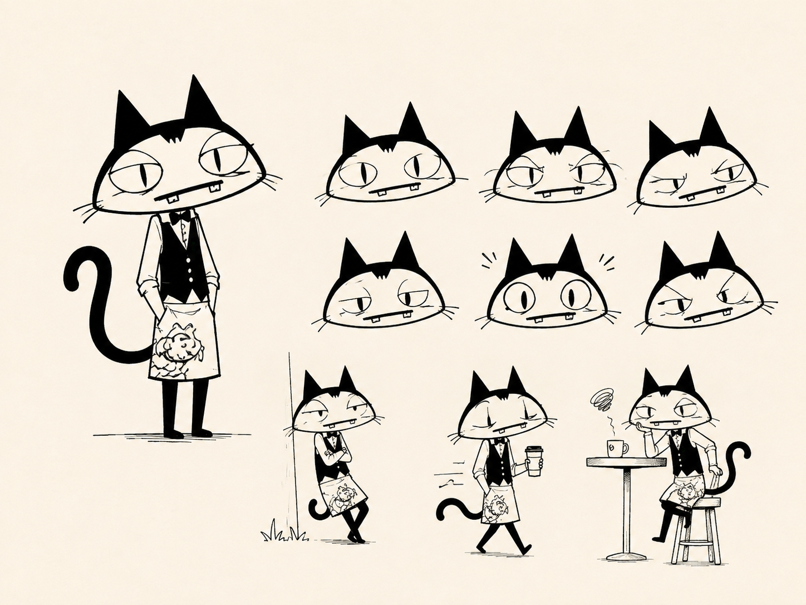 | 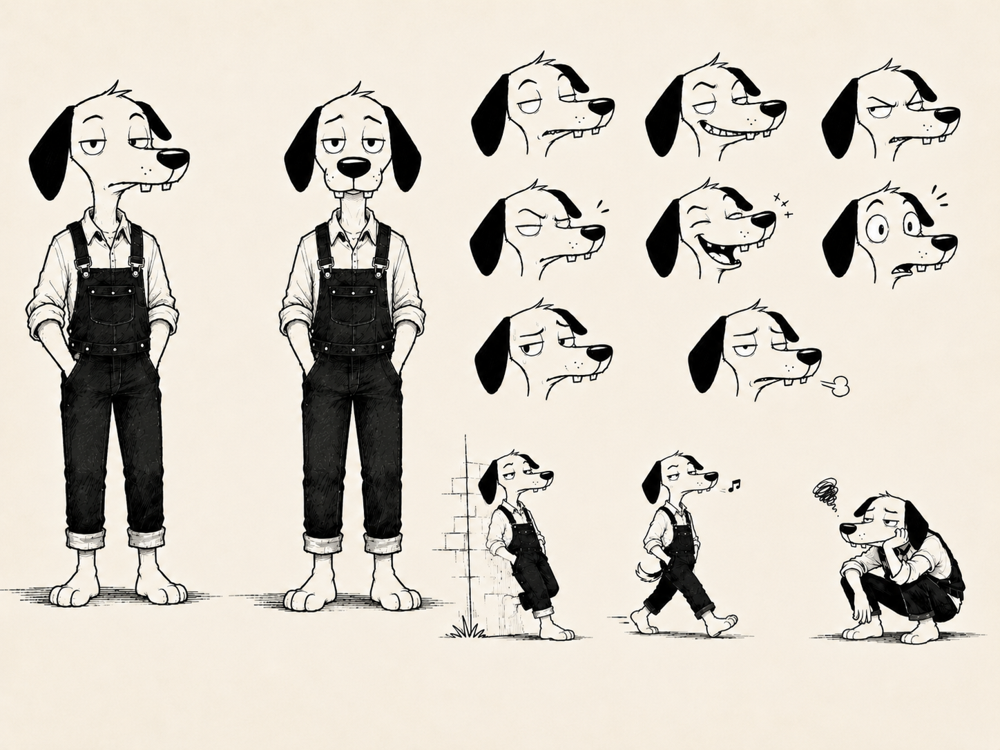 |
| [身份协议](rongbao-illustrations/references/rongbao-identity.md)<br>显式调用：`Use $rongbao-illustrations create 用绒宝做一张正文配图。` | [身份协议](rongbao-illustrations/references/yazai-identity.md)<br>未指定角色时自动使用牙仔；显式调用：`Use $rongbao-illustrations create 用 yazai 做一张正文配图。` | [身份协议](rongbao-illustrations/references/abao-identity.md)<br>显式调用：`Use $rongbao-illustrations create 用阿龅做一张正文配图。` |

默认路由是牙仔；写出角色名或英文别名才切换角色。需要多 IP 同时入图时，可以复制：

```text
Use $rongbao-illustrations create 让绒宝、牙仔和阿龅共同完成一张 16:9 正文配图。
三个角色分别读取各自身份协议和原图，保持彼此独立并共同承担核心动作。
```

### 能力画廊

每项都标出画幅、目标 Skill、是否需要确认安装依赖和可直接复制的调用示例。下列 PNG 都是本项目生成的能力预览，用来证明路由与画幅；它们不是上游 Skill 的官方输出，也不替代角色注册表中的身份原图。

#### Rongbao 原生

| 能力 | 画幅 | 目标 Skill | 需安装依赖 | 复制调用示例 | 本地 PNG |
| --- | --- | --- | --- | --- | --- |
| 正文配图 / `article-illustration` | 16:9 | `rongbao-illustrations` | 否 | `Use $rongbao-illustrations create 为这篇文章生成 4 张牙仔正文配图。` |  |

#### Dongfang

| 能力 | 画幅 | 目标 Skill | 需安装依赖 | 复制调用示例 | 本地 PNG |
| --- | --- | --- | --- | --- | --- |
| 横版封面 / `landscape-cover` | 16:9 | `dongfang-cover-design` | 是，确认安装 `yang0/dongfang` | `Use $rongbao-illustrations create 用绒宝做一张横版封面。` | 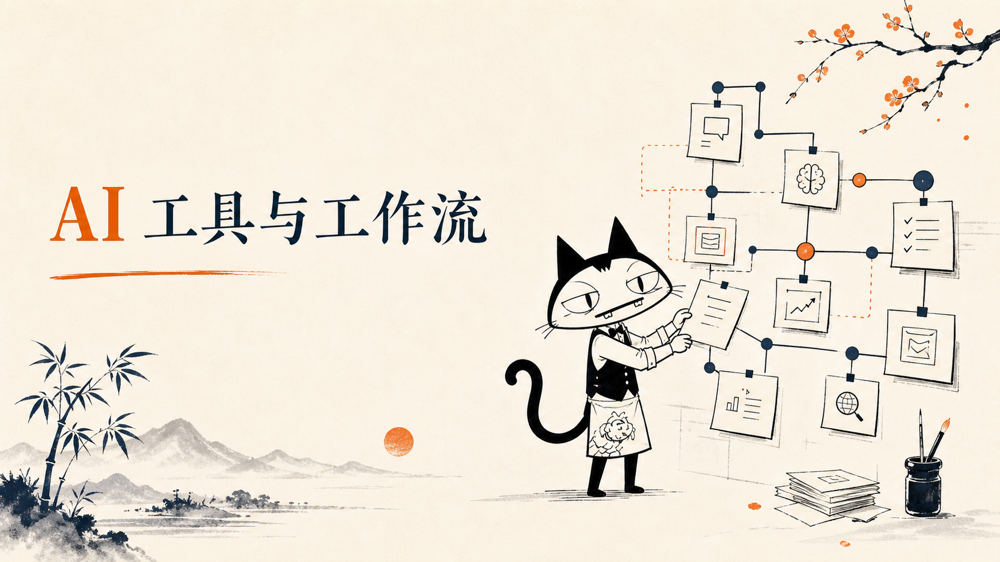 |
| 竖版海报 / `portrait-poster` | 3:4 | `dongfang-cover-design` | 是，确认安装 `yang0/dongfang` | `Use $rongbao-illustrations create 为牙仔做一张竖版海报。` | 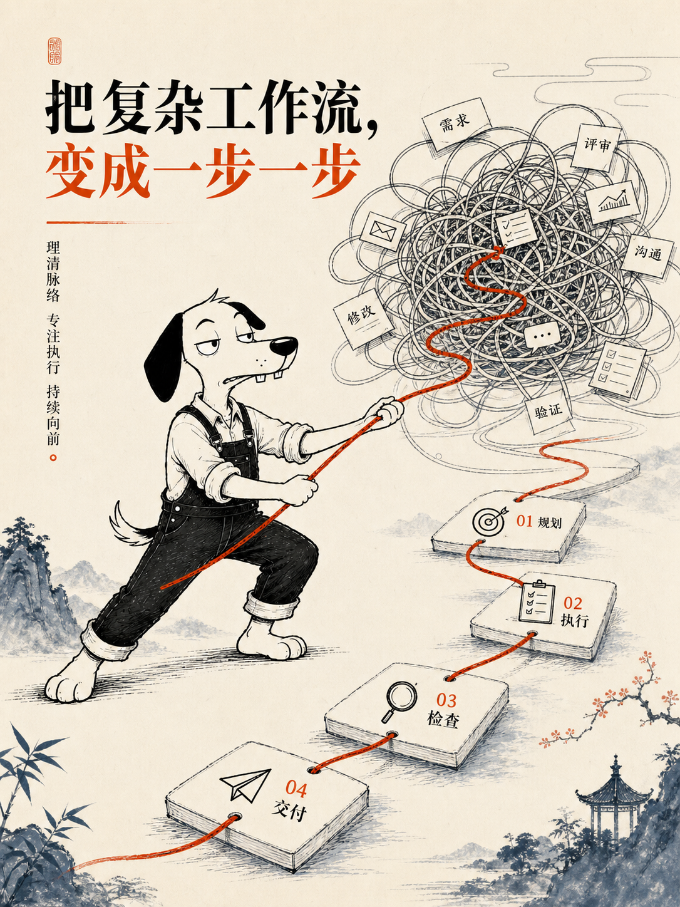 |
| 方图 / `square-graphic` | 1:1 | `dongfang-cover-design` | 是，确认安装 `yang0/dongfang` | `Use $rongbao-illustrations prompt 让阿龅做一张 1:1 方图。` |  |

#### Everett

| 能力 | 画幅 | 目标 Skill | 需安装依赖 | 复制调用示例 | 本地 PNG |
| --- | --- | --- | --- | --- | --- |
| 角色锚点 / `character-anchor` | 3:4 | `ip-illustration-character-system` | 是，确认安装 EverettFish 上游 | `Use $rongbao-illustrations create 用阿龅生成一张角色锚点图。` | 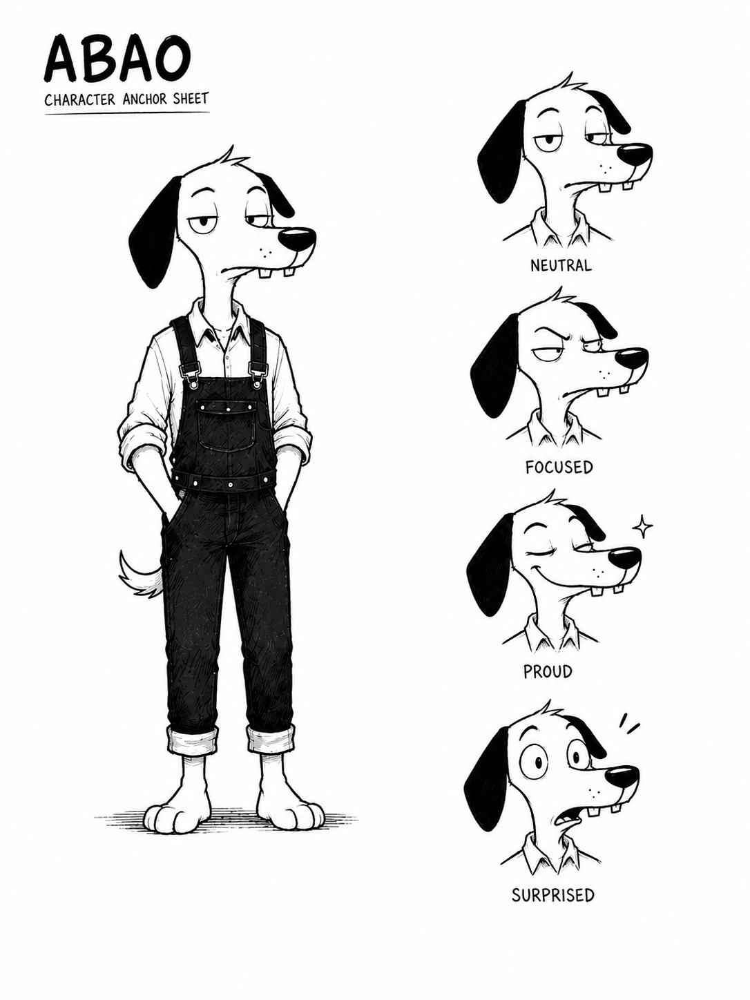 |
| 转面图 / `turnaround-sheet` | 3:4 | `ip-illustration-character-system` | 是，确认安装 EverettFish 上游 | `Use $rongbao-illustrations create 用牙仔做一张 turnaround sheet。` | 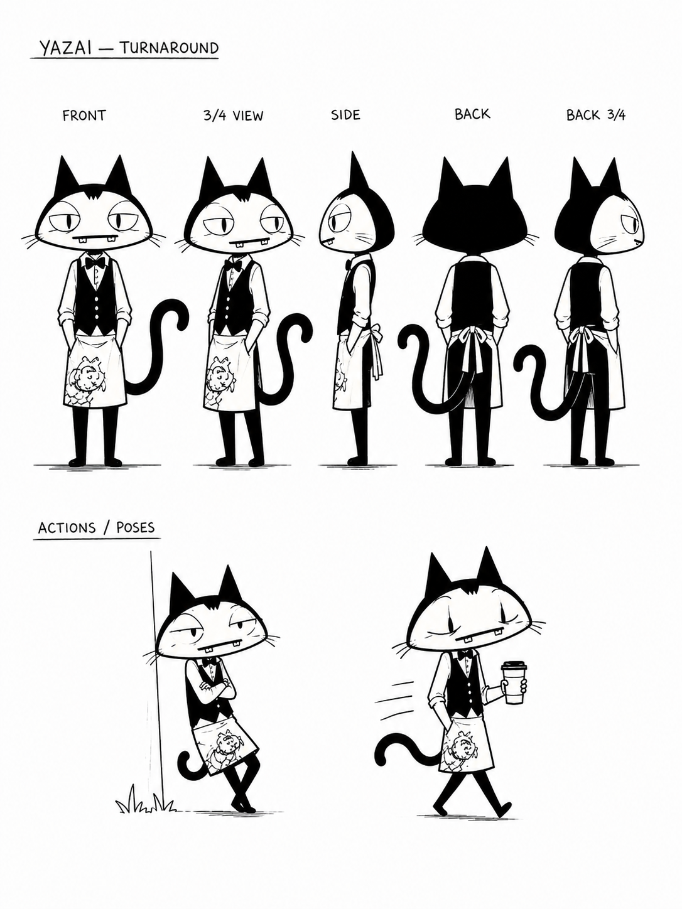 |
| 萌粒小插图 / `mini-article-illustration` | 3:4 | `ip-illustration-character-system` | 是，确认安装 EverettFish 上游 | `Use $rongbao-illustrations create 用绒宝做一张 mini pen-doodle。` | 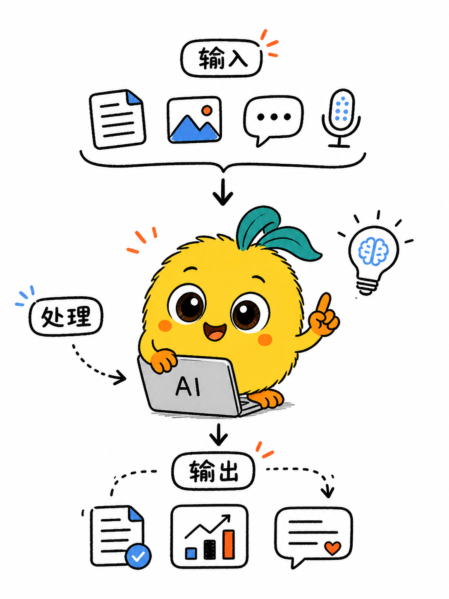 |
| 3:4 信息图 / `article-infographic-3x4` | 3:4 | `ip-illustration-character-system` | 是，确认安装 EverettFish 上游 | `Use $rongbao-illustrations prompt 用绒宝做一张 3:4 信息图。` | 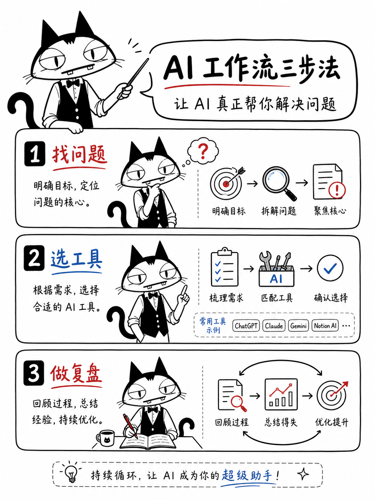 |
| 3:4 贴纸页 / `sticker-sheet-3x4` | 3:4 | `ip-illustration-character-system` | 是，确认安装 EverettFish 上游 | `Use $rongbao-illustrations create 用阿龅做一张 3:4 贴纸页。` |  |

阿龅贴纸是本项目生成的本地预览，不是 Everett 上游素材；正式 Everett 成图仍须安装依赖并遵守 GPT Image 2 确认门禁。

#### Baoyu

| 能力 | 画幅 | 目标 Skill | 需安装依赖 | 复制调用示例 | 本地 PNG |
| --- | --- | --- | --- | --- | --- |
| 文章配图 / `article-illustration` | 16:9 | `baoyu-article-illustrator` | 是，确认安装 Baoyu | `Use $rongbao-illustrations create 用牙仔做一张 Baoyu 文章配图。` |  |
| 知识漫画 / `comic` | 4:3 | `baoyu-comic` | 是，确认安装 Baoyu | `Use $rongbao-illustrations create 用牙仔做一套 Baoyu 知识漫画。` | 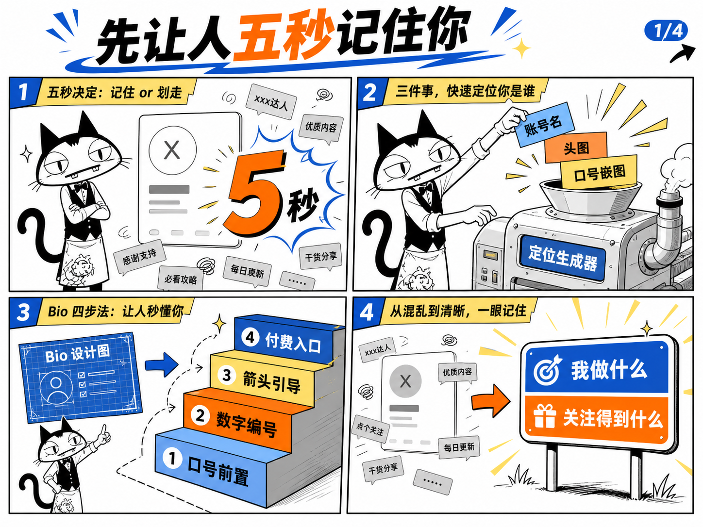 |
| 封面图 / `cover-image` | 4:3 | `baoyu-cover-image` | 是，确认安装 Baoyu | `Use $rongbao-illustrations create 用牙仔做一张 Baoyu 封面图。` |  |
| 信息图 / `infographic` | 4:3 | `baoyu-infographic` | 是，确认安装 Baoyu | `Use $rongbao-illustrations create 用绒宝做一张 Baoyu 信息图。` | 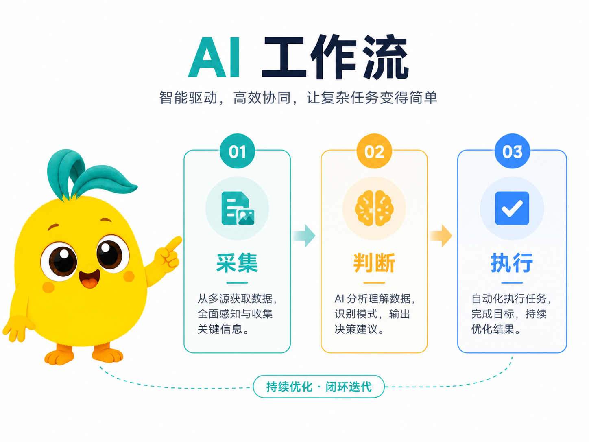 |
| 幻灯片 / `slide-deck` | 16:9 | `baoyu-slide-deck` | 是，确认安装 Baoyu | `Use $rongbao-illustrations create 用阿龅做一套 Baoyu 幻灯片。` | 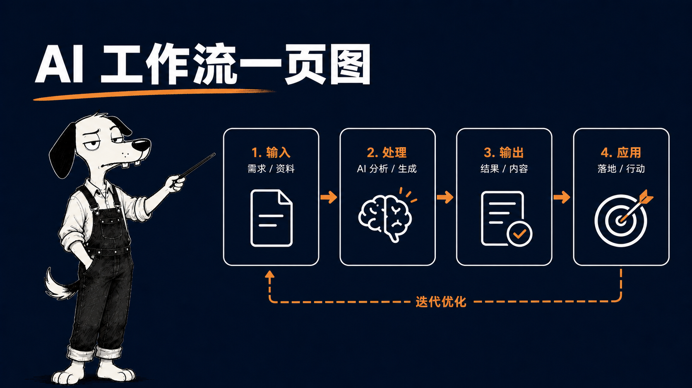 |
| 小红书图片 / `xhs-images` | 3:4 | `baoyu-xhs-images` | 是，确认安装 Baoyu | `Use $rongbao-illustrations create 用绒宝和牙仔做一组 Baoyu 小红书图片。` | 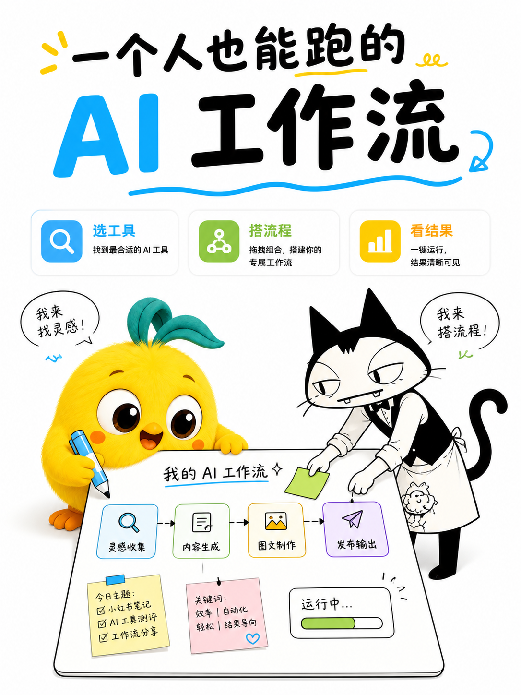 |

`weichen-x-growth-sop` 的漫画页和封面，以及上面 `assets/showcase/` 中的预览，都是本项目生成输出，放在这里作为能力的本地视觉示例，不代表复制了 Baoyu、Dongfang 或 Everett 上游文件。实际调用可选依赖时仍需按上文提示确认安装；没有安装时，路由会展示来源和安装参数，不会把“已挂载”误写成“已打包”。

#### Guizang Social Card

Guizang 是独立的社交卡片排版 Skill，Rongbao 只负责角色选择与身份参考图注入，版式、主题色、平台尺寸和 Live Photo 流程由上游负责。它不修改 Rongbao 的原生白底手绘规则。

下面两张是本项目为 Guizang 生成的风格预览：同一个牙仔身份可以被重新绘制成瑞士网格或电子杂志，而不是强行套用白底简笔画。

| Guizang 瑞士风 3:4 | Guizang 电子杂志风 3:4 |
| --- | --- |
| 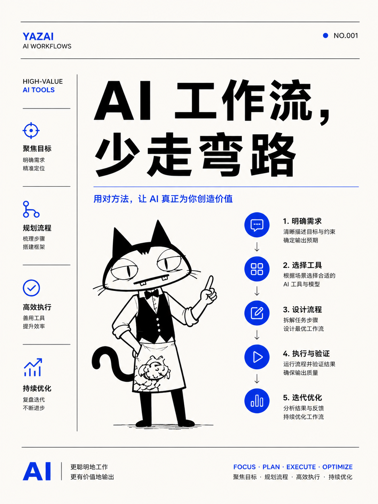 | 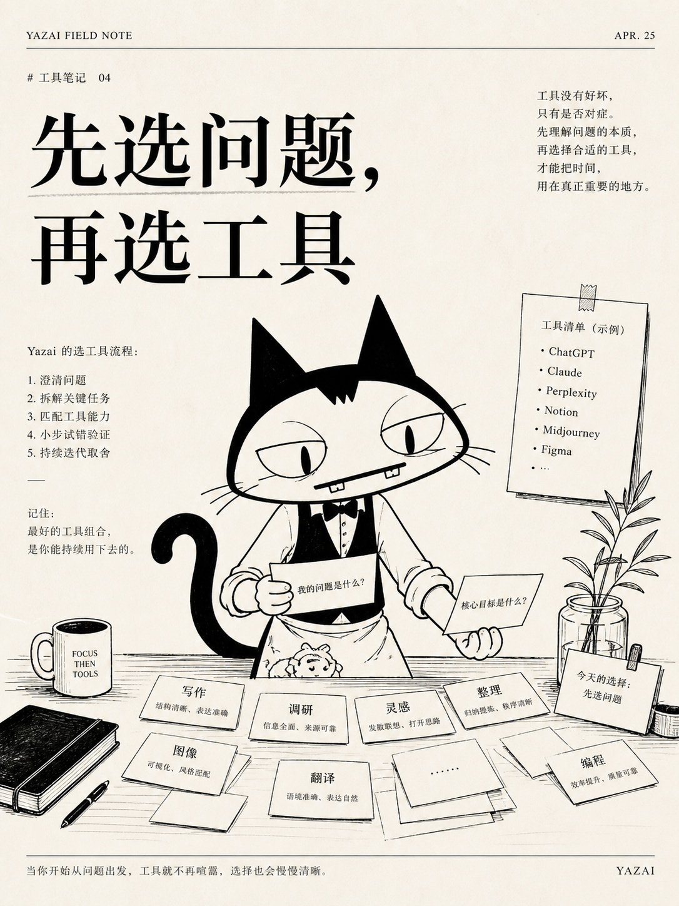 |

| 能力 | 画幅 | 目标 Skill | 需安装依赖 | 复制调用示例 |
| --- | --- | --- | --- | --- |
| 小红书图文组图 / `xhs-social-cards` | 3:4 | `guizang-social-card-skill` | 是，确认安装 Guizang | `Use $rongbao-illustrations create 用牙仔做一套归藏小红书图文。` |
| 瑞士风社交卡 / `swiss-social-card` | 3:4 | `guizang-social-card-skill` | 是，确认安装 Guizang | `Use $rongbao-illustrations create 用阿龅做一套瑞士风社交卡。` |
| 电子杂志风社交卡 / `editorial-social-card` | 3:4 | `guizang-social-card-skill` | 是，确认安装 Guizang | `Use $rongbao-illustrations create 用绒宝做一套电子杂志风小红书图文。` |
| 公众号封面对 / `wechat-cover-pair` | 21:9 + 1:1 | `guizang-social-card-skill` | 是，确认安装 Guizang | `Use $rongbao-illustrations create 用牙仔做公众号 21:9 + 1:1 封面对。` |
| Live Photo / `live-photo-card` | 3:4 / 视频卡 | `guizang-social-card-skill` | 是，确认安装 Guizang | `Use $rongbao-illustrations create 用牙仔把这段视频做成小红书 Live Photo。` |

如果只说“做一套小红书图文”而没有指定视觉系统，路由器会先返回三个候选：归藏瑞士风、归藏电子杂志风、Baoyu 小红书图文；选择后才会生成。显式写“归藏”或 `guizang-social-card-skill` 时不会触发这个询问。

### 挂载 Skill 风格对照

这些示例专门用来说明“角色身份”和“目标媒介”是两层配置。原生 Rongbao 保持白底手绘；挂载 Skill 可以呈现水墨、杂志、网格、漫画和高彩色角色设定等不同结果。

| Dongfang 彩色水墨封面 | Everett 彩色角色锚点 | Baoyu 彩色知识漫画 |
| --- | --- | --- |
|  | 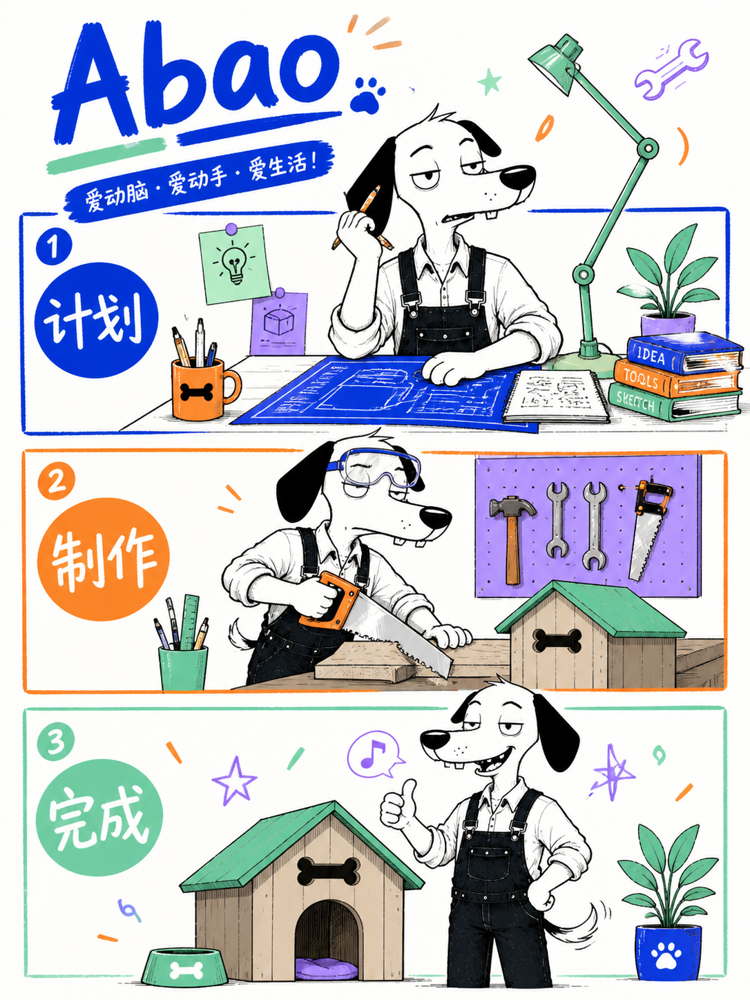 | 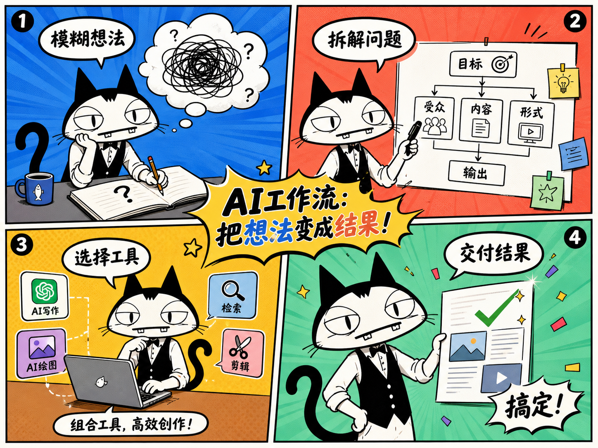 |

这些图是本项目基于各 IP 原图生成的衍生示例，不是上游仓库的官方素材；实际调用时仍由目标 Skill 决定最终媒介和版式。

---

## 示例效果

### 两个断点

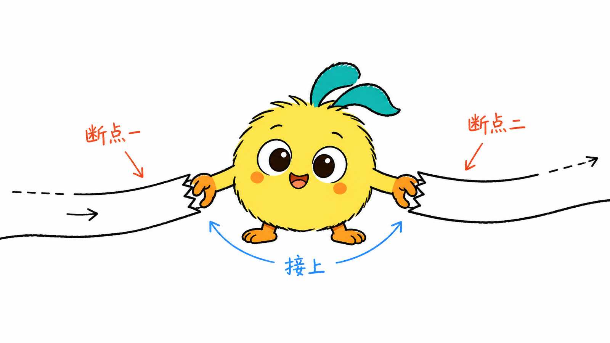

### 按目的分拣

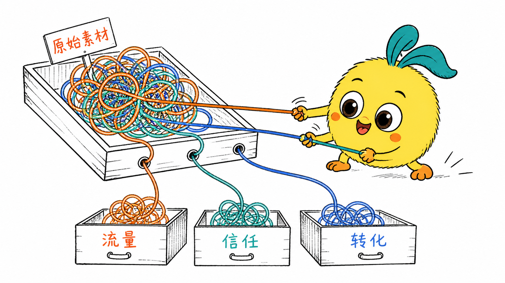

### 一鱼多吃

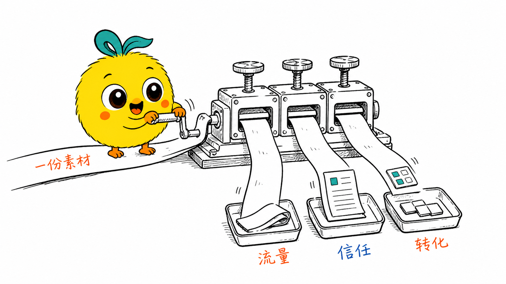

### 承接路径

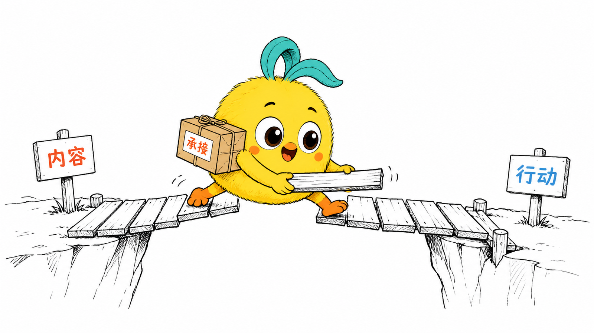

### 信息井

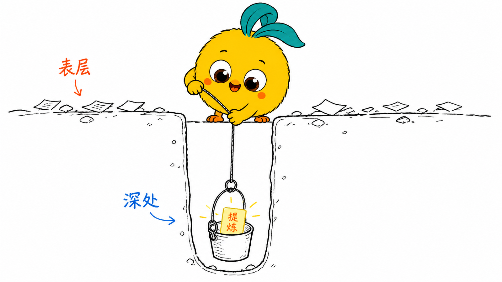

### 想法压机

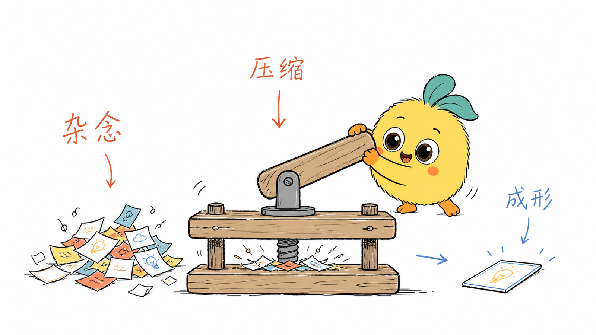

### 内容发酵

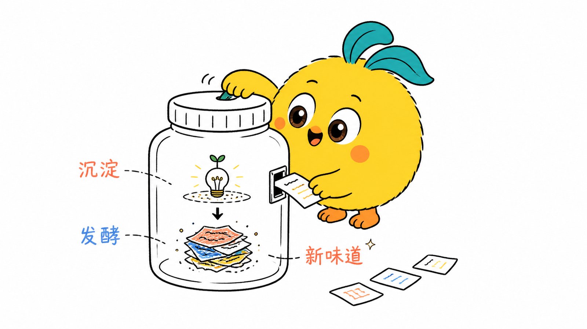

### 信任桥

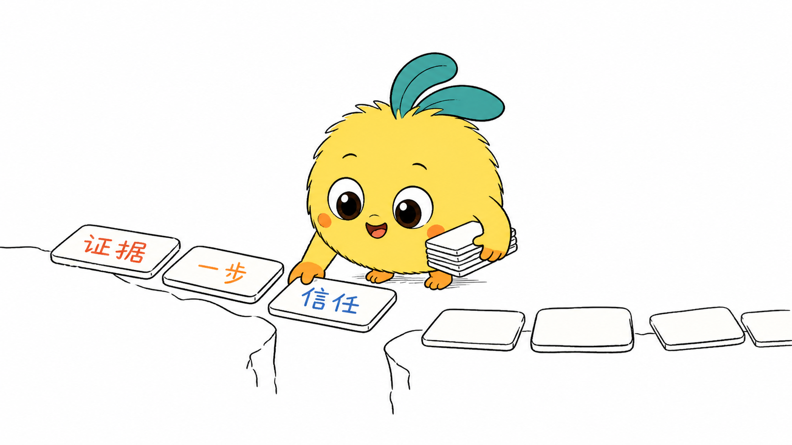

这些图片是风格校准样例，不是构图模板。使用时应该从当前文章重新发明隐喻，不要照抄旧案例的物件和构图。

---

## 安装

克隆仓库：

```bash
git clone https://github.com/yang0/rongbao-illustrations.git
cd rongbao-illustrations
```

复制 skill 到 Codex skills 目录：

```bash
mkdir -p "${CODEX_HOME:-$HOME/.codex}/skills"
cp -R ./rongbao-illustrations "${CODEX_HOME:-$HOME/.codex}/skills/"
```

安装后，在 Codex 里使用：

```text
Use $rongbao-illustrations 为这篇中文文章设计并生成 5 张牙仔黑白怪诞正文配图（未指定角色时默认牙仔）。
```

---

## 怎么用

### 只做配图规划

```text
Use $rongbao-illustrations 先不要生图。
请分析下面这篇文章哪里值得配图，输出 5 张左右的 shot list。
每张图写清楚：放在哪段后、主题、核心意思、结构类型、已选角色在做什么、建议中文标注词。

<粘贴文章>
```

### 直接生成正文配图

```text
Use $rongbao-illustrations 把下面这篇文章生成 4 张牙仔黑白怪诞正文配图。
要求：16:9 横版、纯白背景、黑色手绘线稿、少量红橙蓝中文手写批注。

<粘贴文章>
```

### 为单个概念生成一张图

```text
Use $rongbao-illustrations 为“信任不是喊出来的，而是一块证据一块证据铺过去”生成一张正文配图。
画面要怪诞但清爽，读取 `assets/rongbao.png` 作为绒宝角色参考，并让绒宝承担核心动作。
```

### 指定角色或同时使用多个角色

```text
Use $rongbao-illustrations 为“证据如何累积”生成一张 16:9 正文配图。
请使用牙仔（YAZAI）作为核心动作角色，保留黑白拟人猫身份锚点，不复制参考图材质。
```

```text
Use $rongbao-illustrations 为这个主题生成一张正文配图。
请让绒宝和牙仔一起完成核心动作，两个角色都要保持各自身份，不要把其中一个画成背景装饰或融合成一个角色。
```

```text
Use $rongbao-illustrations 为这个主题生成一张正文配图。
请使用阿龅（abao）作为核心动作角色，读取 `assets/abao.png` 和 `references/abao-identity.md`，保留黑白拟人犬、下垂黑耳、长口鼻和深色工装身份，不复制参考图材质。
```

也可以直接用中文角色名调用：`用阿龅为这篇文章生成正文配图`。

```text
Use $rongbao-illustrations 为这个主题生成一张方图。
请让绒宝、牙仔和阿龅共同完成核心动作，分别读取三张角色参考图，保持三个角色彼此独立，不要把其中任何一个画成背景装饰或混合角色。
```

### 组合生成横版封面

```text
Use $rongbao-illustrations create 为阿龅（abao）IP 做一张横版封面。
主题：把复杂观点变成一个可记忆的视觉入口。请把阿龅作为角色参考，画幅使用 landscape-cover。
```

英文别名同样有效：`Use $rongbao-illustrations create 用 yazai 做一张横版封面。`

显式调用 `$rongbao-illustrations` 与封面/海报/方图同时出现即可触发组合；单独调用 `$dongfang-cover-design` 且没有角色/IP 信号时，不会注入任何角色参考图。

### 组合生成竖版海报

```text
Use $rongbao-illustrations create 为这个 IP 做一张竖版海报。
主题：一条内容从想法到行动的转化。请保留绒宝身份锚点，画幅使用 portrait-poster。
```

### 组合生成方图

```text
Use $rongbao-illustrations prompt 为带绒宝 IP 的 1:1 方图设计一份提示词。
主题：信任由证据逐步累积。请保留绒宝身份锚点，画幅使用 square-graphic，不要直接生图。
```

多角色方图示例：`用绒宝和牙仔设计一张方图`。

### 使用 Guizang 生成社交卡片

```text
Use $rongbao-illustrations create 用牙仔做一套瑞士风小红书图文。
主题：高价值 AI 工具和工作流分享。
请把牙仔原图作为身份参考，角色出现在封面和至少一张内容页；其余页面服从 Guizang 的版式和 3:4 规范。
```

```text
Use $rongbao-illustrations create 用绒宝和阿龅做一组电子杂志风小红书图文。
两个角色分别读取自己的原图和身份协议，不要合成混合角色。
```

如果 Guizang 尚未安装，Rongbao 会展示上游来源、AGPL-3.0 许可证和安装参数；确认后才调用系统安装器，不会把 Guizang 源码复制进本仓库。

### 去掉图里的标题或错误文字

```text
Use $rongbao-illustrations 帮我编辑这张图，去掉左上角的“流程图”标题，其他内容保持不变。
```

更多示例见 [examples/prompts.md](examples/prompts.md)。

---

## 工作流程

这个 skill 的流程是：

1. 读取文章、Markdown、Notion 内容、截图或用户给的主题
2. 解析角色名称，再判断是正文原生模式，还是“角色/IP + 封面/海报/方图”的组合模式
3. 提炼核心观点、认知转折、流程结构和适合视觉化的段落
4. 先输出 shot list：每张图只选一个认知锚点
5. 为每张图选择结构类型：Workflow、系统局部、前后对比、角色状态、概念隐喻、方法分层、地图路线或小漫画分镜
6. 重新发明一个低科技、怪诞但成立的物理隐喻
7. 让已选角色分别承担核心动作，或将注册表声明的角色参考图传给目标设计 Skill；可选上游能力按 `design_router.py` 的顺序装配 style/layout refs
8. 每张图单独调用图像模型生成；组合请求服从目标 Skill 的输出契约
9. 按 QA checklist 检查原生正文图；组合图按目标 Skill 的检查标准验收
10. 原生模式保存到 `assets/<article-slug>-illustrations/`；组合模式遵循目标设计 Skill 的输出路径、格式和交付契约

---

## 目录结构

```text
.
├── README.md
├── LICENSE
├── NOTICE.md
├── assets/
│   ├── rongbao.png
│   ├── yazai.png
│   └── abao.png
├── examples/
│   ├── images/
│   │   ├── 01-two-breakpoints.png
│   │   ├── 02-sort-by-purpose.png
│   │   └── ...
│   └── prompts.md
└── rongbao-illustrations/
    ├── SKILL.md
    ├── agents/
    │   └── openai.yaml
    ├── assets/
    │   ├── rongbao.png
    │   ├── yazai.png
    │   ├── abao.png
    │   └── examples/
    ├── references/
        ├── style-dna.md
        ├── rongbao-ip.md
        ├── rongbao-identity.md
        ├── yazai-identity.md
        ├── abao-identity.md
        ├── character-routing.md
        ├── character-registry.json
        ├── composition-patterns.md
        ├── prompt-template.md
        ├── qa-checklist.md
        ├── design-routing.md
        └── design-dependencies.json
    └── scripts/
        ├── character_router.py
        ├── test_character_router.py
        ├── dependency_utils.py
        ├── design_router.py
        ├── test_design_router.py
        └── doctor.py
```

真正需要安装到 Codex 的是子目录：

```text
rongbao-illustrations/
```

根目录的 README、LICENSE、NOTICE 和 examples 是 GitHub 分享文档。

为兼容已有安装和调用，Skill id、安装目录和 `$rongbao-illustrations` 调用方式保持不变；本仓库使用独立的 `rongbao-illustrations` GitHub 地址，角色默认是牙仔，也可按注册别名选择绒宝、阿龅或任意组合的多个角色。

---

## 注意事项

- 图片里的中文文字越短越稳定。
- 每张图只讲一个核心结构，不要把文章做成说明书。
- 已选角色必须承担核心动作；如果去掉角色画面仍然完全成立，说明角色太装饰了。
- 示例图只用于校准线条密度、留白、颜色克制和默认角色参与方式，不要复刻构图。
- AI 图像模型可能出现错字、幻觉标签、风格漂移或多余标题，生成后需要检查。
- 如果中文错字严重，优先减少标注词并重生成。

---

## 上游来源

本项目由 yang0 独立维护。维护者 X / Twitter：[https://x.com/yang02010](https://x.com/yang02010)。绒宝角色设计源自上游项目作者创作的“小黑”IP，本项目在这一视觉基础上进行独立改编，并保留原有 Skill id、安装目录和调用方式以兼容既有使用习惯。感谢上游项目作者的创作与原始项目基础。

- 上游仓库：[上游仓库](https://github.com/helloianneo/ian-xiaohei-illustrations)
- 可选 IP Illustration 上游：[EverettFish/ip_illustration_for_yourself](https://github.com/EverettFish/ip_illustration_for_yourself)。感谢 EverettFish 提供的萌粒 IP 插画 Skill；本项目仅注册可选依赖，不打包、复制或改写其代码和图片，也不在此声明其许可证。
- 可选 Baoyu 上游：[JimLiu/baoyu-skills](https://github.com/JimLiu/baoyu-skills)。感谢 Jim Liu 提供并维护 Baoyu Skills；上游仓库声明 MIT，本项目只注册可选的 `main` 路径依赖，不打包、复制或改写其代码和素材。IP 原图身份优先于目标 Skill 的风格化表达，但不改变上游 Skill 的其他契约。

---

## License

MIT License. See [LICENSE](LICENSE).
