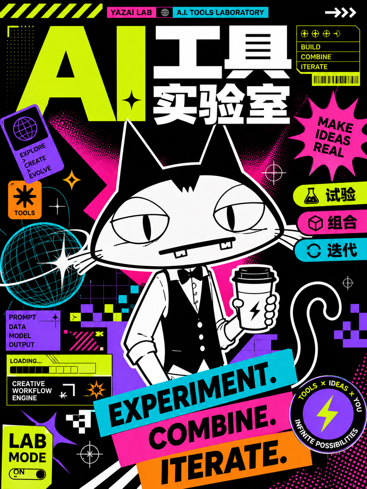

# Rongbao Illustrations / 绒宝配图

> 一个支持多 IP、可组合设计 Skill 的中文内容配图工具。默认 IP：牙仔。
>
> 正文配图 · 封面海报 · 知识漫画 · 信息图 · 社交卡 · 幻灯片 · 3:4 提示词封面

## 先看成图

以下图片都是本项目生成的展示资产，用来直观看到不同目标 Skill 的画幅和媒介。它们不是上游仓库的官方素材。

| 高密度爆款封面 · 16:9 | 真实场景 + 手绘角色 · 4:3 | 3D 动画封面 · 16:9 |
| --- | --- | --- |
|  |  |  |

## 三个 IP

| 牙仔 `yazai` · 默认 | 绒宝 `rongbao` | 阿龅 `abao` |
| --- | --- | --- |
|  |  |  |
| 未指定角色时使用。 [身份协议](rongbao-illustrations/references/yazai-identity.md) | 写“绒宝”或 `rongbao` 激活。 [身份协议](rongbao-illustrations/references/rongbao-identity.md) | 写“阿龅”或 `abao` 激活。 [身份协议](rongbao-illustrations/references/abao-identity.md) |

角色名可以使用中文或英文别名；同时写出多个名字时，所有角色分别读取自己的原图并共同参与画面，不会混合成一个角色。

## 能力画廊

### 正文与知识内容

| Rongbao 原生正文 · 16:9 | Baoyu 文章配图 · 16:9 | Baoyu 知识漫画 · 4:3 |
| --- | --- | --- |
|  |  |  |

| Baoyu 漫画封面 · 4:3 | Baoyu 信息图 · 4:3 | Everett 萌粒插图 · 3:4 |
| --- | --- | --- |
|  |  |  |

### 封面、海报与方图

| Dongfang 高密度横版 · 16:9 | Dongfang 非中式高彩海报 · 16:9 | Dongfang 彩色水墨 · 16:9 |
| --- | --- | --- |
|  |  |  |

| Dongfang 竖版海报 · 3:4 | Dongfang 方图 · 1:1 | gbro 阿龅封面 · 3:4 |
| --- | --- | --- |
|  |  |  |

### 社交卡、信息图与幻灯片

| Guizang 瑞士风 · 3:4 | Guizang 电子杂志风 · 3:4 | Baoyu 小红书组图 · 3:4 |
| --- | --- | --- |
|  |  |  |

| Everett 3:4 信息图 · 3:4 | Baoyu 幻灯片 · 16:9 | 阿龅单张贴纸 · 3:4 |
| --- | --- | --- |
|  |  |  |

### 角色设定与跨媒介

| Everett 角色锚点 · 3:4 | Everett 彩色角色锚点 · 3:4 | Everett 转面图 · 3:4 |
| --- | --- | --- |
|  |  |  |

### 更多原生正文案例

| 按目的分拣 | 一鱼多吃 | 承接路径 |
| --- | --- | --- |
|  |  |  |

| 信息井 | 想法压机 | 内容发酵 |
| --- | --- | --- |
|  |  |  |

完整图片索引见 [`gallery-map.json`](rongbao-illustrations/assets/showcase/gallery-map.json)，图片说明见 [`showcase/README.md`](rongbao-illustrations/assets/showcase/README.md)。

## 最小调用示例

```text
Use $rongbao-illustrations create 为这篇文章生成 4 张牙仔正文配图。
Use $rongbao-illustrations create 用绒宝做一张横版封面。
Use $rongbao-illustrations create 用牙仔和阿龅共同完成一张 16:9 正文配图。
Use $rongbao-illustrations create 用阿龅做一套归藏瑞士风小红书图文。
Use $rongbao-illustrations prompt 用牙仔让 gbro 做一张 3:4 封面提示词。
```

只写“这个 IP”或“带 IP”时，默认使用牙仔；写“绒宝 / `rongbao`”或“阿龅 / `abao`”即可切换。gbro 只输出 3:4 提示词包，不直接生图。

## 能力与可选 Skill

| 来源 | 能力 | 画幅 | 安装与路由 |
| --- | --- | --- | --- |
| Rongbao 原生 | 正文配图、shot list、概念隐喻 | 16:9 | 随仓库安装，默认牙仔 |
| [Dongfang](https://github.com/yang0/dongfang) | 横版封面、竖版海报、方图 | 16:9 / 3:4 / 1:1 | 首次触发时提示确认安装 |
| [Everett IP Illustration](https://github.com/EverettFish/ip_illustration_for_yourself) | 萌粒、角色锚点、转面图、信息图、贴纸页 | 3:4 | 可选；明确确认 GPT Image 2 后才直生图 |
| [Baoyu Skills](https://github.com/JimLiu/baoyu-skills) · MIT | 文章配图、知识漫画、封面、信息图、幻灯片、小红书图片 | 4:3 / 16:9 / 3:4 | 可选；按能力安装对应 Skill |
| [Guizang Social Card](https://github.com/op7418/guizang-social-card-skill) · AGPL-3.0 | 瑞士风、电子杂志风、小红书组图、公众号封面对、Live Photo | 3:4 / 21:9 + 1:1 | 可选；首次触发时提示确认安装 |
| [gbro-cover-design](https://github.com/pyang5166/gbro-cover-design) · MIT | 三轮提问、10 种构图模板、角色参考提示词 | 固定 3:4 | 可选；只输出提示词，不直接生图 |
| [GPT Image 2 Style Library](https://github.com/freestylefly/awesome-gpt-image-2) · MIT | 显式风格模板与提示词增强 | 由基础 Skill 决定 | 可选增强层，不替换目标 Skill |

这些上游项目只在明确触发对应能力时使用；Rongbao 不复制它们的源码、模板或素材。依赖缺失时会显示来源、安装参数并请求确认，安装后再调用。

## 安装

```bash
git clone https://github.com/yang0/rongbao-illustrations.git
cd rongbao-illustrations
mkdir -p "${CODEX_HOME:-$HOME/.codex}/skills"
cp -R ./rongbao-illustrations "${CODEX_HOME:-$HOME/.codex}/skills/"
```

安装后可检查本地状态：

```bash
python rongbao-illustrations/scripts/doctor.py --json
```

详细行为规则：[`SKILL.md`](rongbao-illustrations/SKILL.md) · [`角色注册表`](rongbao-illustrations/references/character-registry.json) · [`设计路由`](rongbao-illustrations/references/design-routing.md) · [`示例提示词`](examples/prompts.md)

## 来源与许可

本项目由 **yang0** 独立维护： [X / Twitter](https://x.com/yang02010)。

感谢原作者创作“小黑”IP；绒宝形象来自这一 IP 设计基础，本项目在此基础上进行独立改编，并保留兼容所需的历史 Skill ID、目录和调用方式。原作者仓库：[helloianneo/ian-xiaohei-illustrations](https://github.com/helloianneo/ian-xiaohei-illustrations)。

Dongfang、Everett、Baoyu、Guizang、gbro 与 GPT Image 2 Style Library 均保留各自上游仓库、作者和许可证边界；本项目只做可选依赖登记、角色参考注入和路由适配。三套 IP 原图与 showcase 展示图由本项目维护或生成。

本项目采用 [MIT License](LICENSE)。更完整的来源说明见 [`NOTICE.md`](NOTICE.md)。
